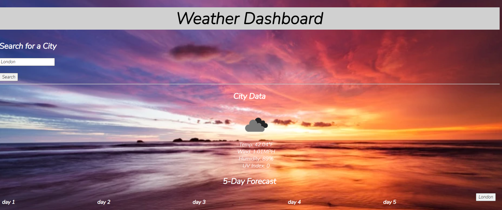

# Weather Dashboard

## Description
This weather dashboard is used to present the current weather of a given city when logged into the search input. The city is then logged in local storage to then be displayed again without having to re-enter the information just with the click of a button. The weather will display the wind speed, uv index, temperature, humidity, and and icon to display the weather. 

## Installation
To install this webpage you will need to load the HTML file and the rest of the application will work. We have not learned how to hide our API key yet otherwise that may need to be added if you are using it on your own terms. 

## Usage
To use this webpage, enter a city into the search input in the top left corner. Click the Search button and that cities current weather will be loaded to the dashboard in addition to a button of all the cities the user has searched. They can then click on the button to reload that cities current weather forecast. 

    
  
## Credits
List your collaborators, if any, with links to their GitHub profiles.
If you used any third-party assets that require attribution, list the creators with links to their primary web presence in this section.
If you followed tutorials, include links to those here as well.

## License
The last section of a high-quality README file is the license. This lets other developers know what they can and cannot do with your project. If you need help choosing a license, refer to [https://choosealicense.com/](https://choosealicense.com/).

# Notable Contributions

Open Weather Api was used to gather data on the searched cities.

Science Focus of the BBC provided the sunset image as the background.

Google Fonts were used to style the font with "Nunito."
